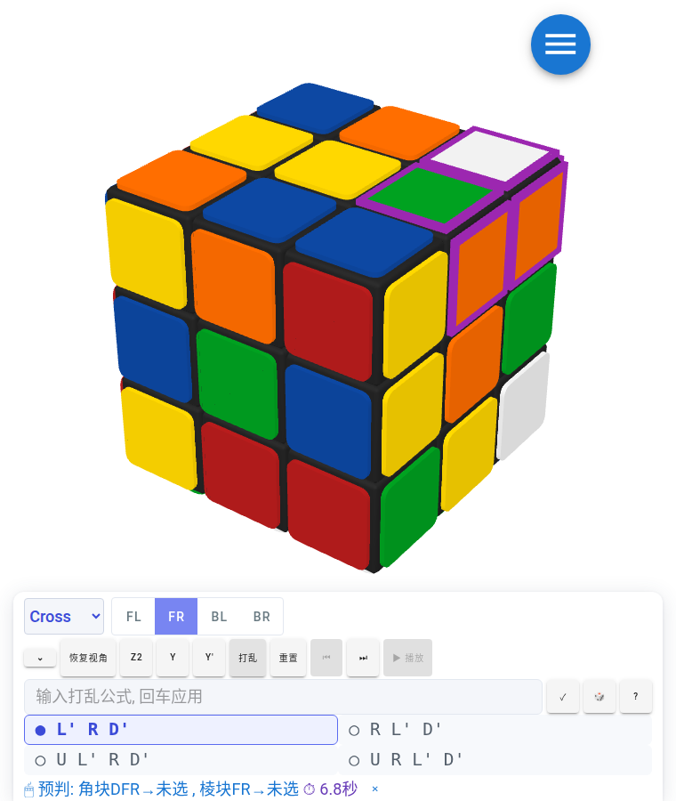

# [魔方栈](https://huazhechen.gitee.io/cuber)

- 优美而强大的网页魔方

- 地址: <https://huazhechen.gitee.io/cuber>
- 地址: <https://andnnl.github.io/cuber/dist>

  

- 使用过程中发现任何问题, 或者有任何需求和想法, 欢迎联系作者:
  > 微信: huazhechen
  >
  > QQ: 37705123
  >
  > email: <37705123@qq.com>
# 运行
  npm run watch
# 推送
  git push github HEAD:v2
# Android APP 打包
  打包教程见 [android/README.md](android/README.md)（一键脚本: `bash android/build-apk.sh`，产物 release APK 约 3MB）
# 功能介绍
## 新增功能，可选白底配色，十字求解
- 十字/XCross 求解算法使用独立 Rust 项目 [cube_cross_solve](https://gitee.com/andnnl/cube_cross_solve)，编译为 WASM 供前端调用

## [十字/F2L 预判训练](https://andnnl.github.io/cuber/dist/?mode=crossf2l)

- 打乱后观察紫色标记的目标块 (F2L 槽位的角块+棱块)，预测十字完成后它们到达的位置并点击选块
- Cross / XCross 两种求解模式，解法列表可切换，支持单步/播放验证预判
- 内置计时与正误判定，支持 z2 / y / y' 基准视角切换与自定义打乱公式

  

## 物理键盘

<table class="table" id="vrckey" style="display: inline-block;">
<tr><th colspan=10>按键表</th></tr>
<tr>
<td>1  </td><td>2  </td><td>3 &lt;</td><td>4 &gt;</td><td>5 M</td>
<td>6 M</td><td>7 &lt;</td><td>8 &gt;</td><td>9  </td><td>0  </td>
</tr><tr>
<td>Q  z'</td><td>W   B</td><td>E  L'</td><td>R Lw'</td><td>T   x</td> 
<td>Y   x</td><td>U  Rw</td><td>I   R</td><td>O  B'</td><td>P   z</td> 
</tr><tr>
<td>A  y'</td><td>S   D</td><td>D   L</td><td>F  U'</td><td>G  F'</td>
<td>H   F</td><td>J   U</td><td>K  R'</td><td>L  D'</td><td>;   y</td>
</tr><tr>
<td>Z  Dw</td><td>X  M'</td><td>C Uw'</td><td>V  Lw</td><td>B  x'</td>
<td>N  x'</td><td>M Rw'</td><td>,  Uw</td><td>.  M'</td><td>/ Dw'</td>
</tr>
<tr>
<td></td>
<td>↑  R</td>
<td></td>
</tr>
<tr>
<td>←  U</td>
<td>↓  R'</td>
<td>→  U'</td>
</tr>
</table>

## [虚拟魔方](https://huazhechen.gitee.io/cuber)

- 触控操作

  

- 撤销操作

  

- 操作历史

  

- 自定义打乱

  

- 复盘

  

## [复原教程](https://huazhechen.gitee.io/cuber/?mode=algs)

- 公式播放

  

* 公式列表

  

- 播放控制

  

## [动画制作](https://huazhechen.gitee.io/cuber?mode=director)

- 场景布置与截图

  

- 动画编写与播放

  

- 导出 gif

  

- 自由涂色

  

- 输出配置

  

- 动画共享

  

## 配置选项

- 阶数选择

  

- 操作设置

  

- 外观设置

  

- 主题设置

  

## 技术栈

- typescript
- webpack
- threejs
- vue
- vuetify
